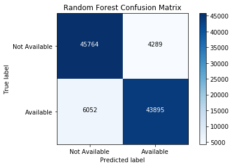
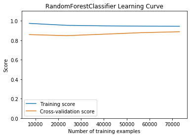
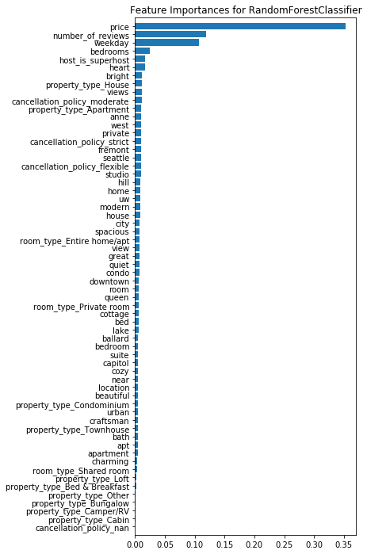
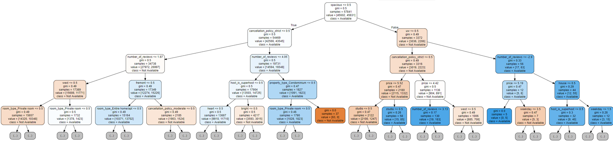

# Predict Availability for Seattle Airbnb
This project was completed as part of the course requirements of Udacity's [Data Scientist Nanodegree](https://www.udacity.com/course/data-scientist-nanodegree--nd025) certification.

## Overview
The project used a [Kaggle dataset](https://www.kaggle.com/airbnb/seattle) containing data about listings Seattle Airbnb listings during 2016.

The project followed the CRISP-DM method of data exploration's six steps of:
1. Business Understanding
2. Data Understanding
3. Data Preparation
4. Modeling
5. Evaluation
6. Deployment

The goal of the project was to predict and determine the important features in predicting availability based on the following business cases:

_You stayed at a great airbnb location for your last vacation. You are thinking of going away in a few months, what is the likelihood that the host will have listed the place as available?_

OR

_You are scrolling through the airbnb site looking at different sites without having selected a date. Is there information that you use from this front page that may indicate that it is more likely that the host has listed the site as available for the dates you have in mind?_

To walk-thru the full project, check out the [notebook](https://github.com/rebeccaebarnes/DSND-Project-4/blob/master/seattle_airbnb_exploration.ipynb).

To read the blog post associated with the article, you can go [here](https://medium.com/@rebeccaebarnes/this-will-make-you-think-like-a-supercomputer-39898ab9eaf8).

## Files
### Data
- **seattle.zip**: Original Kaggle data
- **calendar.csv**: Provides date, availability, and price data for each listing
- **listings.csv**: Provides comprehensive details about each listing including host details, location description and details, and review ratings
- **reviews.csv**: Provides details of review comments
- **tree_dot folder**: Contains `.dot` files of algorithm decision trees

### Images
- **Details of Aibnb listings**:
    - front_page.PNG
    - detail_page.PNG
    - airbnb_listing.PNG
- **tree_img folder**: Contains screenshots of algorithm decision tree visualizations

## Technologies Used
- Python
- Libraries: sklearn, pandas, numpy, matplotlib, seaborn, nltk
- Jupyter Notebook

## Model Development
### Data Wrangling
An extensive review of the available fields in the data was conducted. Fields that did not fit within the proposed business case in any way were dropped. Rows that were missing values in the _bathrooms_, _bedrooms_, _beds_, and _host_is_superhost_ were dropped. Type conversions were performed as necessary.

### Class Balancing
The data was somewhat imbalanced between whether a listing was available or not available. This was balanced by removing some of the available listings at random from the dataset before splits into training and test sets.

### Feature Engineering
Feature engineering included converting categorical columns to dummies, identifying relevant date categories such as day of the week and major holidays, creating dummy columns for missing values, and finding the top features from the listing _name_ using scikit learn's CountVectorizer and a custom tokenize function.

### Custom Transformers
Custom transformers allowed for the identification of skewed columns with a natural log transformation, filling columns based on the mean value per listing ID (or overall mean if missing), and an adapted CountVectorizer transformer. All transformers supported fitting on the train set and saved values applied to the test set.

### Feature Inclusion
The inclusion of features in the model prioritized minimizing the number of features to be included in the model. This was approached by identifying salient pieces of information from an Airbnb listing, limiting a model to the most important features, and investigating the impact of additional features.

## Key Findings

Using a Random Forest Classifier, it was possible to predict whether a host made a listing available with approximately 90% accuracy using only information that is available when browsing the listings and the day of the week for which to predict.

The final model underfit slightly, which is likely due to the intentional limiting of features included in the model.

The most important features in the classifier were _price_, _number of reviews_, the _day of the week_, number of _bedrooms_ and whether the _host is a superhost_. Whether the listing name contained the words _heart_ and _bright_ were the next two most important features.

To further understand the model, visualizations of some of the tree estimators were produced. Below is a visualization of one of the trees at a depth of four. An orange color indicates a greater likelihood of _Not Available_ and a blue color indicates a greater likelihood of _Available_. The darker the color, the more pure the node.

## Acknowledgements
The key visualizations for this project were developed from scikit-learn documentation for
- A [confusion matrix](https://scikit-learn.org/stable/auto_examples/model_selection/plot_confusion_matrix.html#sphx-glr-auto-examples-model-selection-plot-confusion-matrix-py)
- [Plotting learning curves](https://scikit-learn.org/stable/auto_examples/model_selection/plot_learning_curve.html)
- [Feature importances with forests of trees](https://scikit-learn.org/stable/auto_examples/ensemble/plot_forest_importances.html)

The process for visualizing the decision trees was obtained from [this post](https://towardsdatascience.com/how-to-visualize-a-decision-tree-from-a-random-forest-in-python-using-scikit-learn-38ad2d75f21c), using http://webgraphviz.com/.
